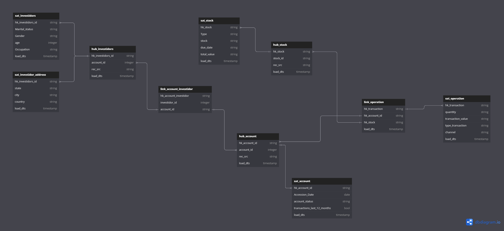

# DataVault 2.0

In this project I intend to show a Data Vault 2.0 modeling using Azure Databricks, with the Medalion architecture (Broze, SIlver and Gold). 

In this project, as a data source, I am using data from the Brazilian Government's Open Data Portal, where I use transaction data from the national treasury. 

## Main features

- Injestao de dados no azure blob storage, em formato json para universalidade de utilizacao, usando python.
- Delta Live Table configuration in databricks for automated data injection
- Creation of a framework for creating a dataplatform team
- Data modeling in the Datavault 2.0 model

###Work in progress.